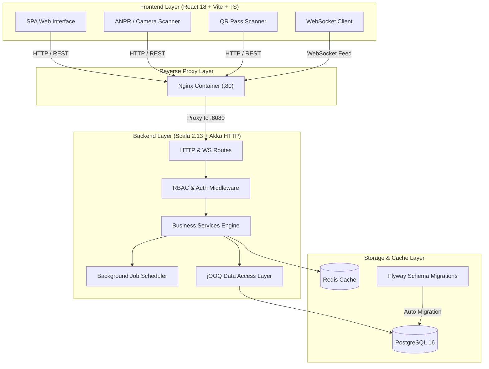

# MetropolisParking

> **Enterprise-Grade Smart Parking Management & Real-Time Analytics Platform**

MetropolisParking is a full-stack, production-ready smart parking management system built with **Scala 2.13 + Akka HTTP** on the backend and **React 18 + Vite + TypeScript** on the frontend. It features automated vehicle tracking, real-time occupancy broadcasting via WebSockets, multi-tier dynamic pricing, ANPR/LPR camera scanning, QR code entry passes, spot advance reservations, and interactive OpenAPI documentation.

---

[](https://opensource.org/licenses/MIT)
[](https://www.scala-lang.org/)
[](https://akka.io/)
[](https://react.dev/)
[](https://www.typescriptlang.org/)
[](https://tailwindcss.com/)
[](https://www.postgresql.org/)
[](https://www.docker.com/)
[](https://playwright.dev/)

---

## Table of Contents

- [Project Overview](#project-overview)
  - [The Problem](#the-problem)
  - [Target Users](#target-users)
  - [Core Objectives & Business Value](#core-objectives--business-value)
- [Key Features](#key-features)
  - [Backend Architecture & Engine](#backend-architecture--engine)
  - [Frontend & User Experience](#frontend--user-experience)
  - [Smart Hardware & Automated Integrations](#smart-hardware--automated-integrations)
  - [Infrastructure & Operations](#infrastructure--operations)
- [Visual Showcase](#visual-showcase)
- [Architecture & Tech Stack](#architecture--tech-stack)
  - [System Architecture](#system-architecture)
  - [Technology Matrix](#technology-matrix)
  - [Database Schema (ERD Overview)](#database-schema-erd-overview)
- [Quick Start](#quick-start)
  - [Prerequisites](#prerequisites)
  - [One-Command Docker Setup](#one-command-docker-setup)
  - [Default Access Credentials](#default-access-credentials)
- [Local Development](#local-development)
  - [Database Setup](#database-setup)
  - [Backend Execution](#backend-execution)
  - [Frontend Execution](#frontend-execution)
- [Configuration & Environment Variables](#configuration--environment-variables)
  - [Backend Config](#backend-config)
  - [Frontend Config](#frontend-config)
- [API Reference & OpenAPI Docs](#api-reference--openapi-docs)
  - [REST API Endpoints](#rest-api-endpoints)
  - [Swagger UI](#swagger-ui)
  - [WebSocket Real-Time Feed](#websocket-real-time-feed)
  - [Sample API Requests & Responses](#sample-api-requests--responses)
- [Testing Strategy](#testing-strategy)
  - [Backend Unit & Integration Tests](#backend-unit--integration-tests)
  - [Frontend Unit & Integration Tests](#frontend-unit--integration-tests)
  - [Playwright E2E Suite](#playwright-e2e-suite)
  - [Automated E2E Shell Script](#automated-e2e-shell-script)
- [Deployment & Production Readiness](#deployment--production-readiness)
- [Troubleshooting & FAQ](#troubleshooting--faq)
- [Repository Structure](#repository-structure)
- [Contributing & License](#contributing--license)

---

## Project Overview

**MetropolisParking** is an end-to-end management platform engineered to digitize parking facilities across commercial centers, residential complexes, and enterprise campuses. It bridges physical hardware automation with high-concurrency cloud architecture to eliminate parking congestion, optimize spot allocation, prevent revenue leakage, and deliver instant visibility to operators and facility managers.

### The Problem

Traditional parking facilities suffer from:
- **Operational Bottlenecks**: Manual ticket issuance and exit gate payment processing create severe vehicle queuing.
- **Suboptimal Occupancy**: Drivers waste fuel searching for available spaces while spots remain hidden across floors.
- **Revenue Leakage**: Lack of audited, time-calculated billing results in inaccurate fee collection and unmonitored parking sessions.
- **Fragmented Data**: Facility managers lack central real-time dashboards to track multi-level floor occupancy, peak usage hours, and revenue trends.

### Target Users

- **Facility Managers & Administrators**: Oversee parking lot topologies, levels, spaces, dynamic rate policies, and financial ledgers.
- **Gate Operators & Security Staff**: Manage real-time check-ins/checkouts, register unknown vehicles, process cash/card settlements, and audit active sessions.
- **Drivers & Customers**: Reserve parking spots in advance, receive instant QR code entry passes, track active parking session duration, and process self-checkout payments.

### Core Objectives & Business Value

- **Zero-Wait Gate Flow**: Automated ANPR camera recognition and digital QR pass validation enable sub-second gate check-ins.
- **Sub-Second Real-Time Visibility**: Live WebSocket push updates deliver instantaneous spot state mutations across all connected browser clients.
- **Dynamic Pricing Engine**: Automated calculation of hourly, daily, flat, and peak-hour rate multipliers maximizes facility yields.
- **Enterprise Security & Compliance**: Strict Role-Based Access Control (RBAC), bcrypt password hashing, stateless JWT authentication, and full transaction audit logging.

---

## Key Features

### Backend Architecture & Engine

- **JWT Authentication & RBAC**: Secure multi-role access control (`ADMIN`, `OPERATOR`, `CUSTOMER`) gating granular API endpoints.
- **Parking Lot & Multi-Floor Topology**: Full hierarchical control over parking lots, floors/levels, and individual parking spaces.
- **Flexible Dynamic Pricing Engine**: Configurable pricing rules supporting hourly rates, daily caps, flat fees, and peak-hour multiplier surcharges.
- **Automated Billing & Payment Processing**: Multi-channel payment lifecycle handling (`CASH`, `CARD`, `UPI`, `WALLET`) with transaction settlement validation.
- **Transactional Integrity via jOOQ**: Type-safe database queries, atomic transaction handling, and schema code generation against PostgreSQL.
- **Structured Logging & Correlation IDs**: MDC-injected correlation IDs across all request handling paths for distributed tracing and auditability.
- **Health & Metrics Monitoring**: Dedicated system health diagnostic endpoints exposing DB pool state, JVM metrics, and application uptime.

### Frontend & User Experience

- **Executive Analytics Dashboard**: Key metric cards for total revenue, active sessions, occupancy percentages, and space status breakdowns.
- **Interactive Multi-Floor Parking Grid**: Visual status badges (`AVAILABLE`, `OCCUPIED`, `RESERVED`, `OUT_OF_SERVICE`) updated instantly without full-page reloads.
- **Vehicle Registry & Search**: Searchable registry tracking license plate formats, owner metadata, and historical parking session logs.
- **Session Management**: Live check-in/checkout workflows with automated duration calculation and real-time fee previews.
- **Payment Ledger & Settlement Modal**: Filterable ledger of pending and completed payments with built-in modal for processing payouts.
- **Modern UI Components**: Styled with Tailwind CSS v4, accessible UI primitives, form validation powered by Zod and React Hook Form, and efficient client caching via TanStack Query.

### Smart Hardware & Automated Integrations

- **ANPR / LPR OCR Camera Scanner**: Web browser camera interface capable of scanning license plates via optical character recognition, triggering automated check-in and checkout API actions (`POST /anpr/entry`, `POST /anpr/exit`).
- **QR Code Entry Pass Generator & Gate Scanner**: Digital pass generation delivering signed QR tokens for drivers and a dedicated camera gate scanner (`/qr-scanner`) for verification.
- **Spot Advance Reservation Engine**: Conflict-checked advance reservation engine ensuring no double-booking across date and time windows.
- **WebSocket Real-Time Broadcast Service**: Akka Streams WebSocket pipeline (`ws://localhost:8080/ws/occupancy`) broadcasting spot state changes to trigger client cache invalidations.
- **Redis Caching & Cron Job Scheduler**: High-throughput Redis caching for aggregated dashboard analytics and an Akka-powered background cron task for auto-expiring stale reservations.
- **Interactive Swagger / OpenAPI 3.0 Documentation**: Fully documented API endpoints rendered directly via embedded Swagger UI at `/api/docs`.

### Infrastructure & Operations

- **Containerized Orchestration**: Production-ready `docker-compose.yml` coordinating backend, frontend, database, and migration containers.
- **Flyway Database Migrations**: Automated version-controlled database schema migrations running on startup.
- **CI/CD Pipeline**: GitHub Actions workflow running code compilation, unit tests, integration tests, and docker image build checks.
- **Playwright E2E Test Suite**: End-to-end browser test automation covering full user journeys (authentication, parking session lifecycle, payments).

---

## Visual Showcase

### Executive Dashboard & Live Parking Grid

```
+-----------------------------------------------------------------------------------+
|  MetropolisParking Dashboard                                                      |
+-------------------+-------------------+-------------------+-----------------------+
| Total Revenue     | Active Sessions   | Total Spaces      | Overall Occupancy     |
| $14,850.00        | 142 Active        | 500 Spots         | 78.4% Occupied        |
+-------------------+-------------------+-------------------+-----------------------+
|  Live Parking Floor Grid (Level 1 - Main Garage)                                  |
|  +--------------+  +--------------+  +--------------+  +--------------+           |
|  | Space A-101  |  | Space A-102  |  | Space A-103  |  | Space A-104  |           |
|  |  AVAILABLE   |  |   OCCUPIED   |  |   RESERVED   |  | OUT_OF_SERVICE|          |
|  |    [Green]   |  |     [Red]    |  |    [Amber]   |  |    [Gray]    |           |
|  +--------------+  +--------------+  +--------------+  +--------------+           |
+-----------------------------------------------------------------------------------+
```

### ANPR Camera License Plate Scanner (`/anpr`)

```
+-----------------------------------------------------------------------------------+
|  ANPR Automatic License Plate Scanner                                             |
+-----------------------------------------------------------------------------------+
|  [ Live Video Feed Camera Viewfinder ]                                            |
|  +-------------------------------------------------------------+                  |
|  |                                                             |                  |
|  |                     [ KA 01 MJ 5544 ]                       |                  |
|  |                                                             |                  |
|  +-------------------------------------------------------------+                  |
|  Detected Plate: "KA 01 MJ 5544" (Confidence: 99.4%)                             |
|  Action: [ Trigger Vehicle Entry ]  [ Trigger Vehicle Exit ]                      |
+-----------------------------------------------------------------------------------+
```

### QR Code Pass Verification (`/qr-scanner`)

```
+-----------------------------------------------------------------------------------+
|  QR Gate Pass Scanner                                                             |
+-----------------------------------------------------------------------------------+
|  +---------------------------+    Token Status: VALID PASS                         |
|  | [|||||  |||| | |||||  |||]|    Vehicle: KA 01 MJ 5544                          |
|  | [||  ||| ||| |||  ||| |||]|    Reserved Spot: Level 1 / Spot A-102             |
|  | [|||||  |||| | |||||  |||]|    Valid Until: 2026-07-24 23:59                   |
|  +---------------------------+    Gate Action: [ OPEN GATE ]                      |
+-----------------------------------------------------------------------------------+
```

---

## Architecture & Tech Stack

### System Architecture



### Technology Matrix

| Layer | Component | Technology | Version | Purpose |
|---|---|---|---|---|
| **Backend** | Runtime | Java | 17 | Core Execution Engine |
| | Language | Scala | 2.13.12 | Functional & Object Programming |
| | Web Framework | Akka HTTP | 10.2.10 | Concurrency & Async HTTP Server |
| | Reactive Streams | Akka Streams | 2.6.20 | WebSocket Stream Processing |
| | Database Access | jOOQ | 3.18.7 | Type-Safe SQL Generation |
| | Connection Pool | HikariCP | 5.1.0 | High-Performance JDBC Pooling |
| | Migrations | Flyway | 9.22.3 | Versioned DB Schema Evolution |
| | Authentication | java-jwt / jBCrypt | 4.4.0 / 0.4 | Stateless JWT & Password Hashing |
| | Caching | Jedis (Redis) | 5.1.0 | Fast In-Memory Analytics Cache |
| **Frontend** | Framework | React | 18.2.0 | User Interface Library |
| | Build Tool | Vite | 5.1.0 | Module Bundling & Hot Reloading |
| | Language | TypeScript | 5.2.2 | Strict Static Type Safety |
| | Styling | Tailwind CSS | v4 | Utility-First Styling System |
| | Server State | TanStack Query | v5 | Data Fetching & Cache Invalidation |
| | HTTP Client | Axios | 1.6.7 | REST Client with Interceptors |
| | Form Handling | React Hook Form + Zod | 7.50 / 3.22 | Client Form Validation & Schemas |
| **DevOps** | Database | PostgreSQL | 16-alpine | Relational Storage Engine |
| | Cache Engine | Redis | 7-alpine | In-Memory Data Structure Store |
| | Proxy | Nginx | alpine | Production Reverse Proxy & Static Web Host |
| | Container | Docker Compose | 24+ | Multi-Container Orchestration |
| | Testing | Vitest / Playwright | 1.2 / 1.41 | Unit, Component, and E2E Testing |

### Database Schema (ERD Overview)

The database schema is organized into 11 key tables managed sequentially by Flyway (V1 through V11):

- `users`: Account identities, email credentials, password hashes, and profiles.
- `roles` & `user_roles`: RBAC permissions mapping users to `ADMIN`, `OPERATOR`, or `CUSTOMER`.
- `parking_lots`: Top-level parking facility entities.
- `parking_levels`: Multi-floor groupings tied to a specific parking lot.
- `parking_spaces`: Individual parking slots with status indicators (`AVAILABLE`, `OCCUPIED`, `RESERVED`, `OUT_OF_SERVICE`).
- `vehicles`: Plate numbers, vehicle types, and owner bindings.
- `parking_sessions`: Active and historical parking check-in/checkout records with duration and calculated fees.
- `pricing_rules`: Hourly, daily, flat, and peak rate rules associated with parking lots/types.
- `payments`: Financial ledger records tracking transaction method, status, and settled amounts.
- `audit_logs`: Immutable trail recording user actions, entity mutations, and timestamps.
- `reservations`: Advance booking records with start/end time windows and status tracking.

---

## Quick Start

### Prerequisites

| Tool | Recommended Version | Download / Installation |
|---|---|---|
| **Docker Engine** | 24.0+ | [Get Docker](https://docs.docker.com/get-docker/) |
| **Docker Compose** | v2.20+ | Included with Docker Desktop |
| **Java JDK** *(local backend dev)* | 17 | [Eclipse Temurin 17](https://adoptium.net/) |
| **sbt** *(local backend dev)* | 1.9+ | [Install sbt](https://www.scala-sbt.org/download.html) |
| **Node.js** *(local frontend dev)* | 20+ | [Node.js Official](https://nodejs.org/) |

### One-Command Docker Setup

Execute the following command from the repository root to start PostgreSQL, Flyway schema migrations, the Scala backend, and the Nginx-proxied React frontend:

```bash
git clone https://github.com/Dharanish-AM/MetropolisParking.git
cd MetropolisParking
docker compose up --build
```

### Default Access Credentials

Once the containers start up, access the system components using the details below:

| Application / Service | URL / Binding | Credentials / Notes |
|---|---|---|
| **Web UI (Frontend)** | `http://localhost` | Default User Web Portal |
| **Backend API** | `http://localhost:8080` | Direct REST API Server |
| **OpenAPI / Swagger UI** | `http://localhost:8080/api/docs` | Interactive API Specs |
| **System Health Check** | `http://localhost:8080/health` | Diagnostic JSON Status |
| **WebSocket Feed** | `ws://localhost:8080/ws/occupancy` | Real-Time Spot Broadcast |
| **Default Admin Account** | — | **Email:** `admin@metropolisparking.com`<br>**Password:** `admin123` |

---

## Local Development

### Database Setup

Run PostgreSQL in containerized mode while building the application locally:

```bash
docker compose up -d db redis
```

Verify that PostgreSQL is running on port `5432` and Redis on port `6379`.

### Backend Execution

Navigate to the backend directory and launch the sbt application. Flyway migrations execute automatically on startup:

```bash
cd backend
sbt run
```

The Akka HTTP server will start on `http://localhost:8080`.

### Frontend Execution

Navigate to the frontend directory, install dependencies, and launch the Vite development server:

```bash
cd frontend
npm install
npm run dev
```

The React frontend server will start on `http://localhost:5174`.

---

## Configuration & Environment Variables

### Backend Config

Environment configuration is managed via HOCON (`backend/src/main/resources/application.conf`) and environment overrides:

| Variable | Description | Default Value |
|---|---|---|
| `DB_URL` | JDBC Connection String | `jdbc:postgresql://localhost:5432/metropolis_parking` |
| `DB_USERNAME` | Database Username | `postgres` |
| `DB_PASSWORD` | Database Password | `password` |
| `JWT_SECRET` | Secret Key for Signing JWT Tokens | `change-in-production-secret-key-32-chars` |
| `REDIS_HOST` | Redis Server Hostname | `localhost` |
| `REDIS_PORT` | Redis Server Port | `6379` |
| `HTTP_PORT` | HTTP Server Binding Port | `8080` |

### Frontend Config

Frontend environment variables can be provided in `frontend/.env.local`:

| Variable | Description | Default Value |
|---|---|---|
| `VITE_API_BASE_URL` | Target Backend API URL | `http://localhost:8080` |
| `VITE_WS_BASE_URL` | Real-time WebSocket Endpoint | `ws://localhost:8080/ws/occupancy` |

---

## API Reference & OpenAPI Docs

### REST API Endpoints

| Method | Endpoint | Required Role | Summary |
|---|---|---|---|
| `POST` | `/auth/login` | Public | Authenticate user and issue JWT token |
| `POST` | `/auth/logout` | Authenticated | Revoke user session |
| `GET` | `/me` | Authenticated | Retrieve authenticated user profile |
| `GET` | `/parking-lots` | Authenticated | List all parking lot facilities |
| `POST` | `/parking-lots` | `ADMIN` | Create a new parking lot facility |
| `GET` | `/parking-lots/:id/levels` | Authenticated | List floors/levels for a given lot |
| `GET` | `/parking-spaces` | Authenticated | Fetch parking spaces with optional status filters |
| `PATCH` | `/parking-spaces/:id/status` | `OPERATOR`, `ADMIN` | Update individual space status |
| `GET` | `/vehicles` | Authenticated | List and search registered vehicles |
| `POST` | `/vehicles` | Authenticated | Register a new vehicle |
| `POST` | `/sessions/start` | `OPERATOR`, `ADMIN` | Start a new parking session |
| `POST` | `/sessions/:plate/end` | `OPERATOR`, `ADMIN` | End active session & calculate fee |
| `POST` | `/anpr/entry` | `OPERATOR`, `ADMIN` | Process automated ANPR entry scan |
| `POST` | `/anpr/exit` | `OPERATOR`, `ADMIN` | Process automated ANPR exit scan |
| `GET` | `/reservations` | Authenticated | List spot advance reservations |
| `POST` | `/reservations` | Authenticated | Reserve a spot for a future time slot |
| `GET` | `/payments` | Authenticated | List payment ledger transactions |
| `POST` | `/payments/:id/process` | `OPERATOR`, `ADMIN` | Settle pending payment invoice |
| `GET` | `/dashboard` | Authenticated | Retrieve aggregated occupancy & revenue statistics |
| `GET` | `/health` | Public | System status and database health check |

### Swagger UI

Interactive Swagger documentation is available at `http://localhost:8080/api/docs` when running the backend. It allows developers to test API payloads, inspect schemas, and verify authentication headers directly in the browser.

### WebSocket Real-Time Feed

Connect to `ws://localhost:8080/ws/occupancy` to receive real-time JSON events when parking space statuses change:

```json
{
  "event": "SPACE_STATUS_MUTATED",
  "spaceId": "3fa85f64-5717-4562-b3fc-2c963f66afa6",
  "spaceNumber": "A-102",
  "previousStatus": "AVAILABLE",
  "newStatus": "OCCUPIED",
  "timestamp": "2026-07-24T21:00:00Z"
}
```

### Sample API Requests & Responses

#### Starting a Parking Session (`POST /sessions/start`)

**Request:**

```json
{
  "plateNumber": "KA01MJ5544",
  "parkingLotId": "b1a7d654-89bc-4def-9012-3456789abcde",
  "vehicleType": "CAR"
}
```

**Response (`201 Created`):**

```json
{
  "sessionId": "e87c9123-4567-89ab-cdef-0123456789ab",
  "plateNumber": "KA01MJ5544",
  "spaceNumber": "A-102",
  "startTime": "2026-07-24T20:15:00Z",
  "status": "ACTIVE"
}
```

---

## Testing Strategy

The repository includes test suites covering unit logic, integration boundaries, and full end-to-end user workflows.

### Backend Unit & Integration Tests

Backend tests are implemented with ScalaTest and run against an active database instance:

```bash
docker compose up -d db

cd backend

# Run all unit tests
sbt test

# Run integration tests specifically
sbt "testOnly *Integration*"
```

### Frontend Unit & Integration Tests

Frontend component unit tests and API integration tests are powered by Vitest, React Testing Library, and Mock Service Worker (MSW):

```bash
cd frontend

# Execute frontend test suite
npm run test

# Run tests in watch mode
npm run test:watch
```

### Playwright E2E Suite

End-to-End browser automation tests verify full UI interaction flows using Playwright:

```bash
cd frontend

# Install Playwright browser dependencies (first-time setup)
npx playwright install chromium

# Run E2E tests headlessly
npm run test:e2e

# Launch interactive Playwright UI runner
npm run test:e2e:ui
```

### Automated E2E Shell Script

Run the automated validation script from the repository root to verify API endpoints, database operations, and session check-in/checkout lifecycles in one command:

```bash
./scripts/e2e-test.sh
```

---

## Deployment & Production Readiness

### Docker Multi-Stage Builds

The project uses multi-stage Docker builds to keep production images minimal and secure:

- **Backend Dockerfile**: Compiles Scala source via sbt in a builder stage and runs the resulting fat JAR using a lightweight JDK 17 runtime image (`eclipse-temurin:17-jre-alpine`).
- **Frontend Dockerfile**: Builds production static assets via Node 20 (`npm run build`) and serves them using Nginx (`nginx:1.25-alpine`) configured for single-page app routing and reverse-proxying backend requests.

### Security Hardening

- **Stateless Authentication**: Passwords hashed using bcrypt; API routes protected by HMAC-SHA256 signed JWT tokens.
- **SQL Injection Prevention**: All queries rendered via jOOQ type-safe parameter binding.
- **Strict Role Gating**: RBAC middleware validates user claims on every restricted endpoint.
- **CORS Protection**: Access control headers restricted to authorized origins in production configs.

---

## Troubleshooting & FAQ

<details>
<summary><strong>1. Database connection error when running sbt run locally</strong></summary>

Ensure the PostgreSQL container is running on port `5432`:
```bash
docker compose ps
```
If the port is occupied by another local PostgreSQL instance, either stop the local service or adjust `DB_URL` in `backend/.env`.
</details>

<details>
<summary><strong>2. Flyway migration checksum validation failure</strong></summary>

If migration scripts were edited after execution, Flyway may fail validation. Reset the local container volume:
```bash
docker compose down -v
docker compose up -d db
```
</details>

<details>
<summary><strong>3. Frontend API requests fail with 404 or CORS error</strong></summary>

Verify that `VITE_API_BASE_URL` points to `http://localhost:8080` for local frontend development, or `/api` when running in Docker Nginx mode.
</details>

<details>
<summary><strong>4. Playwright tests fail to connect to frontend</strong></summary>

Ensure both backend (`:8080`) and frontend (`:5174`) dev servers are running before executing `npm run test:e2e`.
</details>

---

## Repository Structure

```
MetropolisParking/
├── .github/
│   └── workflows/
│       └── ci.yml              # GitHub Actions automated CI workflow
├── backend/
│   ├── src/
│   │   ├── main/
│   │   │   ├── resources/
│   │   │   │   ├── db/migration/  # Flyway SQL schema scripts (V1-V10)
│   │   │   │   └── application.conf # HOCON environment configuration
│   │   │   └── scala/com/metropolis/
│   │   │       ├── api/        # Akka HTTP routes & RBAC middleware
│   │   │       ├── service/    # Core business logic & pricing engine
│   │   │       ├── repository/ # jOOQ database repositories
│   │   │       ├── model/      # Clean domain case classes
│   │   │       └── Main.scala  # Application entrypoint & dependency injection
│   │   └── test/               # ScalaTest unit & integration tests
│   ├── build.sbt               # SBT build settings & dependency definitions
│   └── Dockerfile              # Multi-stage Scala backend container build
├── frontend/
│   ├── e2e/                    # Playwright end-to-end test specs
│   ├── src/
│   │   ├── api/                # Axios instance & TanStack Query client
│   │   ├── components/         # Reusable stateless UI primitives
│   │   ├── features/           # Feature modules (Dashboard, Grid, ANPR, Payments)
│   │   ├── pages/              # Top-level page view components
│   │   └── main.tsx            # React application entrypoint
│   ├── nginx.conf              # Production Nginx reverse proxy configuration
│   ├── package.json            # Node.js dependencies & test scripts
│   └── Dockerfile              # Multi-stage React + Nginx container build
├── scripts/
│   └── e2e-test.sh             # Full automated smoke test script
├── docker-compose.yml          # Root multi-container orchestration configuration
└── README.md                   # Project documentation
```

---

## Contributing & License

### Contributing

Contributions to MetropolisParking are welcome! Please follow these guidelines:

1. Fork the repository and create a feature branch (`git checkout -b feature/amazing-feature`).
2. Ensure all unit, integration, and E2E tests pass (`sbt test` and `npm run test`).
3. Maintain code clean formatting without unused imports or unnecessary code comments.
4. Open a detailed Pull Request describing your changes.

### License

This project is open-source software licensed under the [MIT License](LICENSE).
