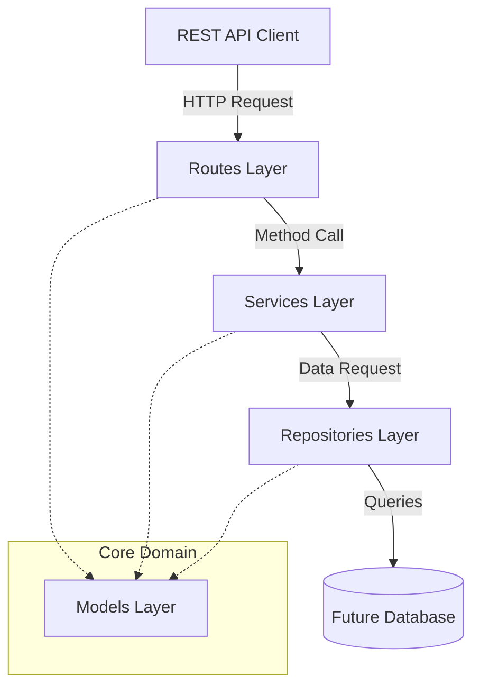

# Metropolis Parking - Architecture & Design Walkthrough

This document outlines the architecture, technology stack, and engineering practices for Deliver 1 of the **Metropolis Parking** backend service scaffold.

---

## 1. Architecture Overview

Metropolis Parking is organized around a **Clean Layered Architecture** pattern. In the current codebase, this architecture is only partially implemented: the route layer is active, while the service and repository layers exist as interfaces for future work.



### Layer Responsibilities
* **HTTP/Routes Layer**: Parses JSON, handles routing parameters, binds HTTP endpoints, and marshals Scala structures to HTTP responses. This is the only implemented runtime layer today through `GET /health`.
* **Services (Business Logic) Layer**: Defined as traits today. Intended to implement business rules and coordinate operations across repositories.
* **Repositories (Data Access) Layer**: Defined as traits today. Intended to encapsulate data persistence.
* **Models Layer**: Houses raw data transfer objects (DTOs) and domain entities. It has zero external dependencies.

---

## 2. Project Structure Explanation

The project's directories and files are organized as follows:

```text
MetropolisParking/
├── .github/workflows/ci.yml         # Continuous Integration runner script
├── docs/Design-Walkthrough.md       # High-level architecture document (this file)
├── project/
│   ├── build.properties             # Locks the SBT compiler runner version (1.10.7)
│   └── plugins.sbt                  # Registers the sbt-assembly plugin
├── src/
│   ├── main/
│   │   ├── resources/
│   │   │   ├── application.conf     # Base config containing env placeholders
│   │   │   ├── application-local.conf # Dev settings for local running
│   │   │   ├── application-dev.conf # Staging dev env settings
│   │   │   ├── application-test.conf# Testing setup (binds to a distinct port)
│   │   │   └── logback.xml          # Logback config for console logging
│   │   └── scala/com/metropolisparking/
│   │       ├── Main.scala           # App bootstrapping & shutdown lifecycle manager
│   │       ├── config/
│   │       │   └── AppConfig.scala  # Config representations & loader via PureConfig
│   │       ├── models/
│   │       │   └── ParkingModels.scala # Case classes representing domain models
│   │       ├── repositories/
│   │       │   └── ParkingRepository.scala # Persistence layer interface skeleton
│   │       ├── routes/
│   │       │   └── HealthRoute.scala   # HTTP controller mapping health routes
│   │       └── services/
│   │           └── ParkingService.scala# Business logic layer interface skeleton
│   └── test/scala/com/metropolisparking/
│       ├── config/
│       │   └── AppConfigSpec.scala  # Configuration loading tests
│       └── routes/
│           └── HealthRouteSpec.scala # Integration/Unit testing suite for HealthRoute
├── build.sbt                        # SBT project dependency configuration
├── Dockerfile                       # Multi-stage production container instructions
└── docker-compose.yml               # Container orchestration file
```

---

## 3. Technology Choices and Rationale

* **Scala 2.13.18 & SBT**: A robust, functional-first JVM language offering type-safety, concurrency features, and compile-time correctness checks.
* **Akka HTTP (v10.2.10)**: Chosen for its high performance, lightweight footprint, and non-blocking, asynchronous HTTP architecture on the JVM.
* **PureConfig (v0.17.8)**: Simplifies configuration loading by parsing HOCON configurations directly into type-safe Scala case classes at application boot.
* **Logback & SLF4J**: Enterprise logging standard. Fully integrated to write structured log messages to stdout for standard container logging.
* **ScalaTest & Akka HTTP Testkit**: Used for validating HTTP routes. The current test suite covers the health endpoint.

---

## 4. Configuration Strategy

Configuration loading leverages **Typesafe Config** (the engine behind PureConfig) and environment variable substitution. 

1. **Environment Selection**: Driven by the `APP_ENV` environment variable, defaulting to `local`.
2. **File Hierarchy**:
   * Running in `local` environment loads `application-local.conf`.
   * Running in `dev` environment loads `application-dev.conf`.
   * Running in `test` environment loads `application-test.conf`.
   * Running in `production` environment loads `application-production.conf`.
3. **Inheritance**: Each environment file starts with `include "application"`. This prevents configuration duplication, as environment files inherit all values from `application.conf` and only define necessary overrides.
4. **Environment Variables**: Important runtime parameters (like host and port binding) are mapped to environment variables (e.g., `HTTP_HOST`, `HTTP_PORT`) with safe default fallbacks.
5. **Validation**: Unsupported `APP_ENV` values fail during startup with a clear error rather than falling through to a missing config file.

---

## 5. Dockerization Strategy

The application is containerized using a **multi-stage build** structure in the `Dockerfile`:

1. **Builder Stage (`eclipse-temurin:17-jdk`)**:
   * Installs SBT manually to eliminate dependency on third-party images.
   * Copies sbt build definitions first to download and cache external dependencies before copying source code.
   * Compiles and bundles the application into a single executable Fat JAR via `sbt assembly`.
2. **Runtime Stage (`eclipse-temurin:17-jre`)**:
   * Starts from a lightweight JRE image.
   * Copies only the final compiled JAR from the builder stage, keeping the image size small.
   * Creates a dedicated non-root user (`appuser`) and group (`appgroup`) to execute the application, conforming to container security best practices.

---

## 6. Continuous Integration (CI) Strategy

The GitHub Actions workflow in `.github/workflows/ci.yml` triggers on all push and pull-request events targeting the `main` and `develop` branches:
* **JDK Setup**: Configures Java 17 using the Temurin distribution.
* **Caching**: Automatically caches `.sbt` and `.ivy2` files. This decreases pipeline runs from minutes to seconds by avoiding downloading compiler/library tools on every execution.
* **Verification**: Executes `sbt compile Test/compile` followed by `sbt test`. The build fails if there are compile warnings/errors (enforced by `-Xfatal-warnings` compiler flag) or if any tests fail.
* **Current Test Scope**: The existing automated test coverage is limited to the health route.

---

## 7. Scalability and Maintainability Considerations

### Scalability
* **Reactive Model**: Akka HTTP is built on Akka Streams, which handles request/response paths asynchronously with backpressure. This allows the backend to handle high traffic volume on minimal memory footprints.
* **Non-blocking Execution**: The application utilizes standard `Future`-based computations, ensuring the main HTTP threads never block on backend operations.

### Maintainability
* **Decoupled Interfaces**: Repository and Service layers are defined as Scala traits. This keeps future implementations swappable, though no concrete business or persistence implementation has been wired yet.
* **Type-Safety**: Configurations and request objects map to strongly typed Scala data structures at boundaries, preventing bad states from propagating deep into the call stack.

---

## 8. Future Enhancements
* **Database Integration**: Introduce a concrete repository implementation using slick or doobie, coupled with Flyway database migrations.
* **Security (OAuth2 / JWT)**: Guard routes layer using authentication and authorization directives.
* **Monitoring & Observability**: Integrate Prometheus metrics and OpenTelemetry trace metrics to monitor service health.
