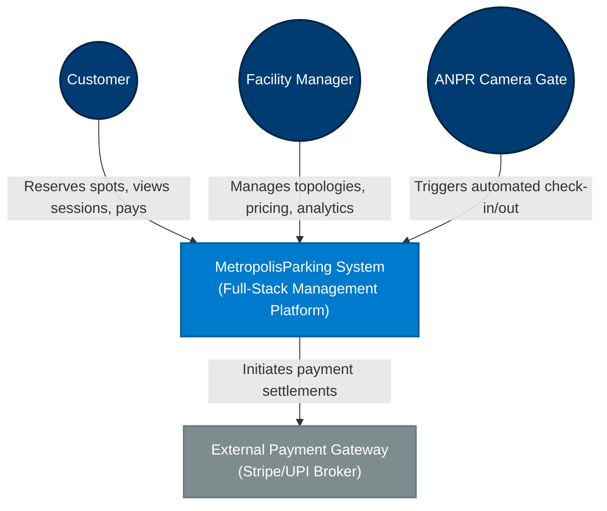
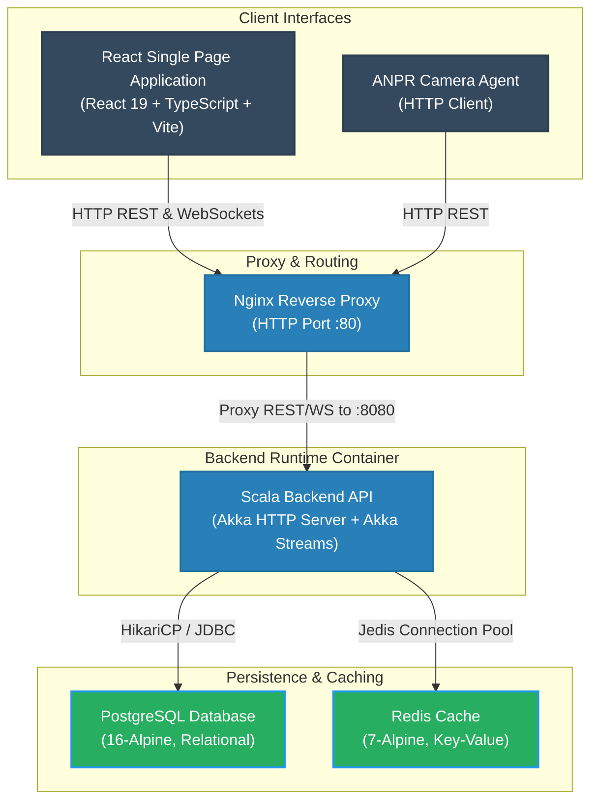
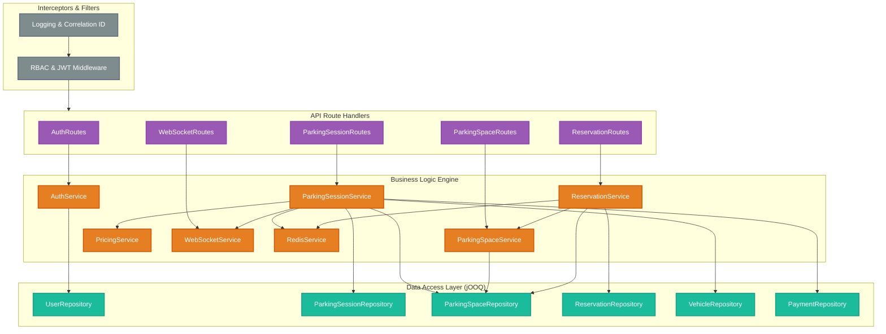
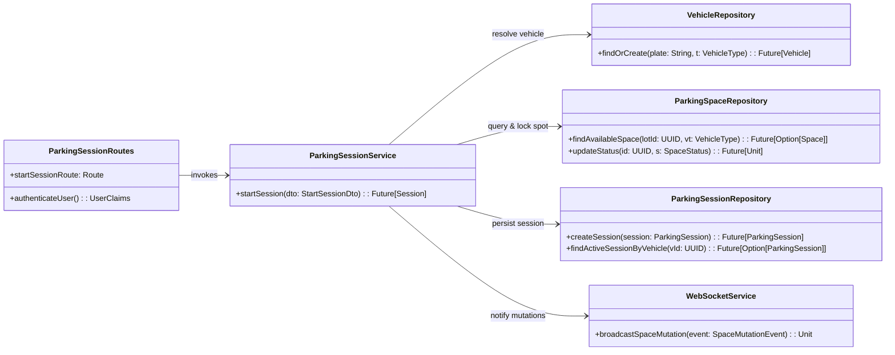
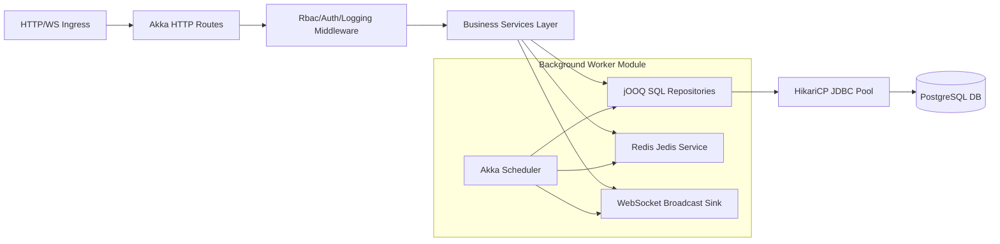
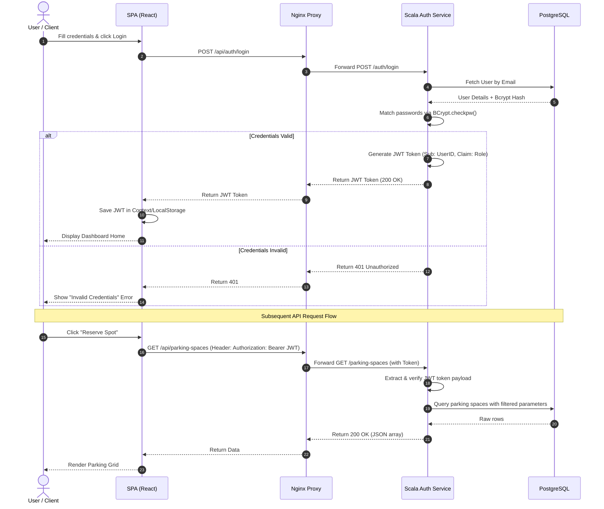
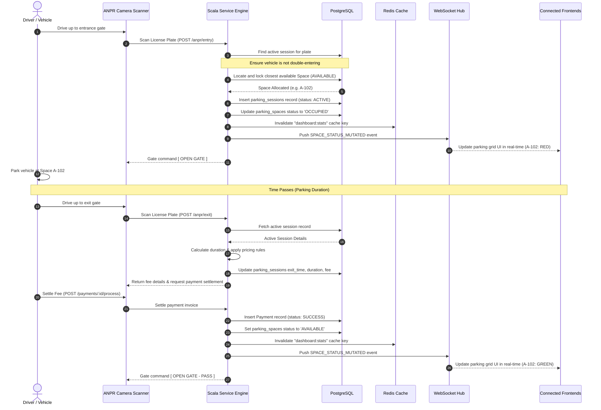
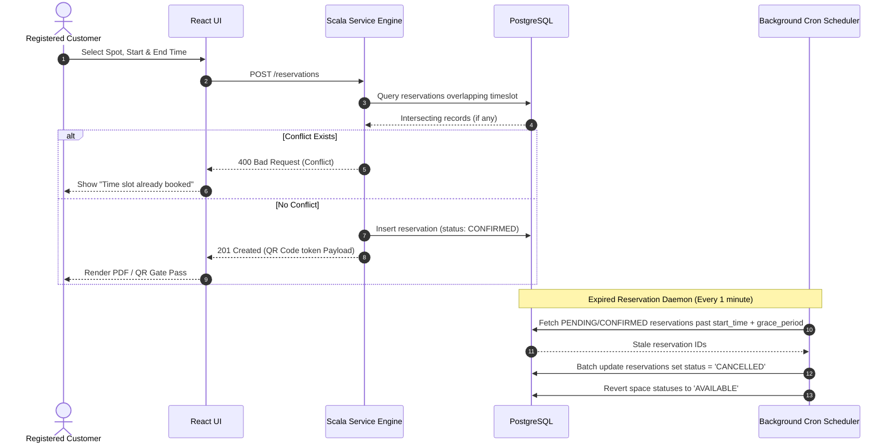
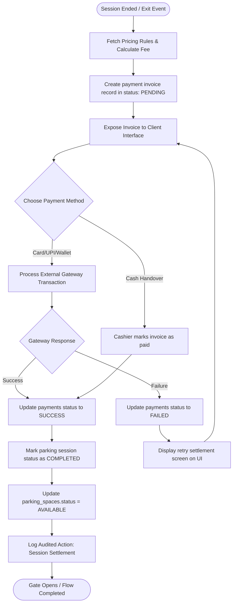
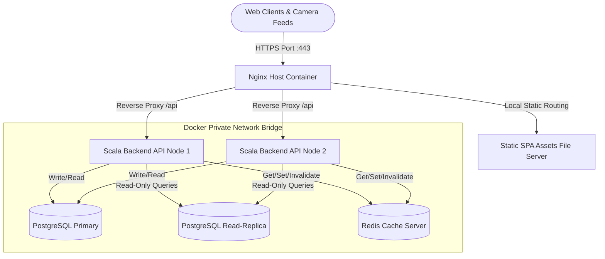

# MetropolisParking — Enterprise Architecture & Design Document

This document provides a comprehensive, production-grade engineering design specification for the **MetropolisParking** system. It details the system architecture using the C4 model, database schema entity-relationships, service dependencies, core lifecycle sequences, deployment strategies, and cross-cutting operational concerns.

---

## 1. C4 Architecture Model

The system architecture is modeled hierarchically to separate high-level system context from low-level component execution and code patterns.

### Level 1: System Context Diagram
The System Context Diagram defines the boundaries of MetropolisParking, the external actors interacting with it, and integration touchpoints.



### Level 2: Container Diagram
The Container Diagram illustrates the high-level technical choices, data storage systems, proxy routing layers, and how data flows between them.



### Level 3: Component Diagram (Scala Backend)
This diagram zooms into the Scala Backend container to show the internal logic layers, dependency directions, and boundaries.



### Level 4: Code Diagram (Detailed Start Session Flow)
This diagram illustrates the code execution structure of the **Session Entry/Check-in** workflow.



---

## 2. Database Entity-Relationship Diagram (ERD)

The PostgreSQL database schema consists of 11 core tables designed for integrity, speed, and strict referential constraints.

```mermaid
erDiagram
    users {
        UUID id PK
        VARCHAR name
        VARCHAR email UK
        VARCHAR password_hash
        UUID role_id FK
        TIMESTAMP WITH_TIME_ZONE created_at
        TIMESTAMP WITH_TIME_ZONE updated_at
        TIMESTAMP WITH_TIME_ZONE deleted_at
    }
    roles {
        UUID id PK
        VARCHAR name UK
        VARCHAR description
    }
    permissions {
        UUID id PK
        VARCHAR name UK
        VARCHAR description
    }
    role_permissions {
        UUID role_id PK, FK
        UUID permission_id PK, FK
    }
    vehicles {
        UUID id PK
        VARCHAR plate_number UK
        VARCHAR type
        UUID owner_id FK
        TIMESTAMP WITH_TIME_ZONE created_at
        TIMESTAMP WITH_TIME_ZONE updated_at
        TIMESTAMP WITH_TIME_ZONE deleted_at
    }
    parking_lots {
        UUID id PK
        VARCHAR name
        VARCHAR location
        TIMESTAMP WITH_TIME_ZONE created_at
        TIMESTAMP WITH_TIME_ZONE updated_at
        TIMESTAMP WITH_TIME_ZONE deleted_at
    }
    parking_levels {
        UUID id PK
        UUID lot_id FK
        INT level_number
        TIMESTAMP WITH_TIME_ZONE created_at
        TIMESTAMP WITH_TIME_ZONE updated_at
    }
    parking_spaces {
        UUID id PK
        UUID lot_id FK
        UUID level_id FK
        VARCHAR space_number
        VARCHAR type
        VARCHAR status
        TIMESTAMP WITH_TIME_ZONE created_at
        TIMESTAMP WITH_TIME_ZONE updated_at
        TIMESTAMP WITH_TIME_ZONE deleted_at
    }
    reservations {
        UUID id PK
        UUID user_id FK
        UUID space_id FK
        TIMESTAMP WITH_TIME_ZONE start_time
        TIMESTAMP WITH_TIME_ZONE end_time
        VARCHAR status
        NUMERIC fee
        TIMESTAMP WITH_TIME_ZONE created_at
        TIMESTAMP WITH_TIME_ZONE updated_at
    }
    parking_sessions {
        UUID id PK
        UUID vehicle_id FK
        UUID space_id FK
        TIMESTAMP WITH_TIME_ZONE entry_time
        TIMESTAMP WITH_TIME_ZONE exit_time
        INT duration_minutes
        DECIMAL fee
        TIMESTAMP WITH_TIME_ZONE created_at
        TIMESTAMP WITH_TIME_ZONE updated_at
    }
    pricing_rules {
        UUID id PK
        VARCHAR rule_type
        DECIMAL rate
        VARCHAR vehicle_type
        UUID lot_id FK
        TIMESTAMP WITH_TIME_ZONE created_at
        TIMESTAMP WITH_TIME_ZONE updated_at
    }
    payments {
        UUID id PK
        UUID session_id FK
        DECIMAL amount
        VARCHAR method
        VARCHAR status
        TIMESTAMP WITH_TIME_ZONE created_at
        TIMESTAMP WITH_TIME_ZONE updated_at
    }
    audit_logs {
        UUID id PK
        UUID user_id FK
        VARCHAR action
        VARCHAR entity_type
        UUID entity_id
        TEXT details
        TIMESTAMP WITH_TIME_ZONE timestamp
    }

    users ||--o| roles : has
    roles ||--o{ role_permissions : defines
    permissions ||--o{ role_permissions : grants
    users ||--o{ vehicles : owns
    parking_lots ||--o{ parking_levels : has
    parking_levels ||--o{ parking_spaces : contains
    parking_lots ||--o{ parking_spaces : indexes
    parking_spaces ||--o{ reservations : books
    users ||--o{ reservations : creates
    vehicles ||--o{ parking_sessions : logs
    parking_spaces ||--o{ parking_sessions : hosts
    parking_sessions ||--o| payments : settles
    parking_lots ||--o{ pricing_rules : applies
    users ||--o{ audit_logs : logs_action
```

---

## 3. Service Dependency Diagrams

This diagram details system dependencies from the API ingress through the backend modules, database, and background processes.



---

## 4. Authentication Sequence Diagram

Standard stateless login and subsequent authenticated request workflow using JWT tokens.



---

## 5. Parking Session Lifecycle Sequence

The primary checkout workflow: from entry detection (ANPR/manual) through real-time spot occupancy to departure and payment settlement.



---

## 6. Reservation Lifecycle Sequence

The spot advance reservation engine prevents booking conflicts and transitions booking slots automatically.



---

## 7. Payment Processing Workflow

Ensuring transactional safety and audit-logged transparency for financial calculations.



---

## 8. Deployment Architecture

Containerized infrastructure using a Docker Compose layered layout, ready for orchestration platforms.



---

## 9. Observability and Monitoring Architecture

Production reliability is maintained using a multi-tiered logging and diagnostic dashboard approach.

- **Correlation Tracing (MDC)**:
  Every incoming API request is stamped with a unique `X-Correlation-ID` header. This identifier is propagated down through the Akka HTTP middleware, services, and repository layers, and injected into the Logback logging context (MDC) so that all logs matching a single client request can be aggregated instantaneously.
- **System Health Diagnostics**:
  Exposes the `/health` endpoint containing:
  - **Database Connection Pool Status**: Max active connections, currently borrowed connections, pending threads.
  - **Redis Cache Status**: Active pings (`PONG`).
  - **System Resources**: JVM memory heap usage, CPU load, and server uptime.
- **Metric Ingestion Engine**:
  - **Prometheus Scraper**: Exposes Prometheus-compatible endpoints collecting JVM stats, Hikari connection latency, and HTTP request counters.
  - **Grafana Visualization**: Enterprise panels visualizing response times (P99, P95), active sessions, database query timings, and system logs.

---

## 10. Performance Considerations

To sustain sub-second responses even at maximum load, the system implements:

### Database Indexing Strategy
- **Unique Indices**: Explicit unique constraints on `users.email` and `vehicles.plate_number`.
- **Search Indices**: Composite query index on `reservations(space_id, start_time, end_time)` to expedite overlap/conflict validation searches.
- **Foreign Key Indexing**: Explicit indices on foreign keys: `parking_spaces.lot_id`, `parking_spaces.level_id`, `parking_sessions.space_id`, and `parking_sessions.vehicle_id`.

### In-Memory Caching (Redis)
- **Aggregation Cache**: Dashboard metrics (`dashboard:stats`) are aggregated and cached with a Time-To-Live (TTL) of 300 seconds.
- **Cache Eviction**: Every session write (`startSession`, `endSession`), space mutation, or reservation booking triggers an immediate synchronous invalidate (`del`) call to the Redis key, ensuring data freshness.

### Connection Pooling (HikariCP)
- **Configuration**:
  - `maximumPoolSize`: 16 (per backend node).
  - `minimumIdle`: 8.
  - `idleTimeout`: 30000 ms.
  - `connectionTimeout`: 5000 ms.

---

## 11. Security Model

Security is baked directly into the API gateways and application boundary controls.

- **Cryptography & Hashing**:
  - Passwords are never stored in plaintext. They are salted and hashed utilizing the **BCrypt** algorithm (Work Factor: 12).
- **Stateless Authorization Token (JWT)**:
  - Access tokens are signed using the **HMAC-SHA256** signature scheme.
  - Token validation is processed entirely stateless in memory via the `RbacMiddleware` directive, minimizing database load.
- **Granular Access Policies (RBAC)**:
  - Roles (`ADMIN`, `CUSTOMER`) map to specific fine-grained permissions.
  - Endpoints utilize the Scala route directives to apply role checks:
    ```scala
    authorizeRoles(Set("ADMIN")) { claims =>
       // Admin actions only
    }
    ```
- **Immutable Transactions & Audit Logging**:
  - Critical database writes and permission changes populate the `audit_logs` table via transaction triggers or explicit repository calls.
  - The `audit_logs` schema has no update/delete access points to preserve historical traceability.

---

## 12. Scalability Strategy

The platform is designed to scale out horizontally as demand grows:

1. **Stateless Backend Nodes**:
   - The backend contains no sticky server sessions. All client state resides in the JWT token or the underlying database.
2. **WebSocket Fan-out & Akka Stream Source**:
   - Live occupancy data is pushed down through an Akka Streams Source using `Source.queue` and broadcasted via `MergeHub.source`. This maintains connection multiplexing at low memory overhead.
3. **Redis Pub/Sub Synchronization**:
   - When running multiple horizontal backend containers behind Nginx, a spot change on Node 1 is published via a Redis channel. Node 2 and Node 3 subscribe to this channel and broadcast the mutation to their locally connected WebSocket browser clients.
4. **Database Separation**:
   - Read-heavy requests (such as displaying active maps or generating reports) route to the PostgreSQL Read-Replica, leaving the Primary Database fully available for write-intensive ticket check-in and checkout flows.
